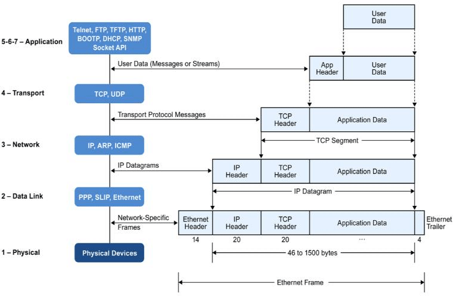

# COMPUTER-SCIENCE

This is about computer science faced while studying or working.

1. 트랜지스터
   1. 컴퓨터의 기본 요소
   2. CPU는 트랜지스터의 덩어리
   3. 기능
      1. 스위치(전기적 신호)
      2. 증폭
   4. 1bit = 트랜지스터 1
   5. 컴퓨터
   6. 모래 -> 규소 -> 실리콘 -> 컴퓨터
   7. 튜링 테스트(튜링기계)
   8. 폰 노이만(우주 최강의 두뇌ㅋㅋ) 기계
      1. 메모리를 따로 쓰자(현대 컴퓨터)
2. 컴퓨터의 원리
   1. 컴퓨터는 명령을 순서대로 수행
   2. `1`과 `0`으로 이미지, 문자 등 모두 표현할 수 있다.
   3. ASCII CODE
      1. 255개 문자를 표현(256 = 0 ~ 255)
      2. 한 문자당 1byte
   4. UNICODE
      1. UTF-8(영문자/숫자: 1byte, 이외의 문자: 3byte)
      2. UTF-16(한 문자당 2byte)
   5. HDD -> CACHE -> CPU -> REGISTER(연산)
3. 프로그래밍 언어
4. 프로그램
5. 명령과 순서를 쓴 문서(글)
6. 사람의 언어 -(코딩)-> 프로그래밍 언어 -(컴파일)-> 기계어
7. 고급언어(디컴파일이 어렵다)
8. 컴파일 언어
   1. 코딩 -> 빌드 -> 기계어
   2. C, C++
9. 동적 언어(인터프리트 언어)
   1. 코딩 -> 빌드 -> 중간상태 -(프로그램이 동작할 때)-> 기계어
   2. JAVA, C#, PYTHON, JAVASCRIPT
10. 어셈블리어(디컴파일이 쉽다)
11. **프로그래머는 한가지 언어에 집착하면 안된다.**
12. 컴파일언어와 동적언어의 차이
13. 컴파일언어
14. 속도 빠름
15. platform 별로 변환해야 함
16. 동적언어
17. 속도 느림
18. platform 별로 변환필요 없음
19. Thread
    1. 현대 프로그래밍에서 중요한 프로그래밍 기술이고 어렵다
    2. 웹개발은 필요x
    3. 시스템이나 게임서버는 필수
    4. context thread
       1. 한 프로세스를 실행하다가 다른 프로세스를 실행할 때 일어나는 cpu의 process 전환
    5. 스레드를 너무 많이 만들기 되면 context switching 비용이 많이 들어 비효율적이다.
    6. cpu갯수보다 thread 갯수가 많아지면 context switching이 일어난다.
20. OOD의 SOLID
    1. OOD
       1. Object Oriented Design
       2. Object 중심의 설계(아키텍처)
    2. SOLID(OOD의 5가지 설계 원칙)
       1. **Single Responsibility Principle**(단일책임원칙)
          1. 하나의 객체는 하나의 책임을 가져야 한다.
          2. Ex)
             1. 예금잔고 객체
                1. 입금, 출금으로 책임을 나눌 것인지
                2. 입출금으로 할 것인지
       2. **Open Closed Principle**(개방폐쇄의 원칙)
          1. 확장에는 열려있고, 변경에는 닫혀있어야 한다.
          2. 1번과 2번만 잘 지켜도 좋은 프로그래밍이다.
       3. Liskov Subtitution Principle(리스코프 치환 이론)
          1. Base Type의 기존 함수 또는 동작을 바꾸지 말아라.(상속에서 가끔 문제가 생김)
          2. golang에서는 상속이 없다.
             1. 그래서 golang은 oop가 아니다?
                1. oop에 상속이 있어야 한다는 내용은 없다.
       4. Interface Segregation Principle(인터페이스 분리 원칙)
          1. 여러개의 관계를 모아놓은 인터페이스보다 관계 하나씩 정의하는 것이 더 좋다.
             1. Ex) 게임
                1. 케릭터의 동작을 모은 것보다 각각 분리해놓은 것이 낫다.(의존성이 낮아짐)
       5. Dependency Inversion Priciple(의존성역전의 원칙)
          1. 관계는 인터페이스에 의존하는 것이 객체에 의존하는 것보다 좋다.
    3. 의존성을 낮추고 응집성을 높이기 위함
21. Beyond OOP
    1. OOP는 잘 만들기 어렵고 새로운 프로그래머가 파악하는데 시간이 오래 걸린다.
    2. 현대에 와서 생긴 OOP의 문제점
       1. 실리콘 밸리
          1. Tech Debt
             1. Make fast(빨리 만들고)
             2. Break things(빨리 없애자)에서 Fast Break Things로 ...가는 움직임이 되고 Stateless가 나오게 되었다.
             3. 에 적합하지 않다
    3. 절차적 프로그래밍(상태, 기능 분리) -> OOP(상태, 기능 혼재) -> Stateless
    4. Stateless(상태를 없애버리고 기능만 만들자, 상태는 외부에서 만들어서 가져오자, 레고조립)
       1. Micro Service(웹)
       2. Serverless(웹)
       3. Functional(language)
          1. erlang
          2. lisp
          3. scala
          4. F#
          5. elixir
       4. ECS(게임)
          1. Entity Component System
       5. MVC(UI)
          1. Model
             1. data
          2. View
          3. Controller
             1. 기능
22. 마지막 강좌
    1. 컴퓨터 공학
       1. 지식
          1. 습득(공부)
       2. 기술
          1. 숙달(연습)
    2. 지속적으로 공부해야 할 것
       1. 컴퓨터원리 -> 하드웨어 -> CPU설계
       2. 프로그래밍 언어와 문법
       3. 자료구조 & 알고리즘
       4. Thread & 고급기능
       5. OOP -> 설계 -> 아키텍처
    3. 만들고 싶은 것이 있어야 한다.
       1. Make Anything!!
          1. 자료조사(break down)
23. handle
    1. 자원에 대한 참조
    2. 파일 서술자(file descriptor / file handle), 네트워크 소켓, PID(프로세스 식별자) 등
24. context
    1. 작업이 중단되고 나중에 같은 지점에서 계속 될 수 있수 있도록 저장해야하는 작업(프로세스, 스레드 등)에서 사용하는 최소한의 데이터 셋, 그러므로 os.Create()를 통해 파일을 생성하기 위해 file handle을 열어줬다면 다시 닫아줘야 interruped가 생기지 않는다. context data는 register에 있다.
25. register
    1. 컴퓨터에 존재하는 다목적 저장 공간이며 CPU내부에 존재하기 때문에 고속으로 데이터를 처리할 수 있다.
26. RAM(Random Access Memory)
    1. 데이터가 저장되어 있는 물리적인 저장소
27. MIME(Multipurpose Internet Mail Extensions)
    1. 파일변환(https://server-talk.tistory.com/183)
28. buffer
29. escape
30. BitMask
    1. A mask defines which bits you want to keep, and which bits you want to clear
       1. AND(&)
          1. bit의 subset을 추출
       2. ORing(||)
          1. bit의 subset을 설정
       3. XORing(^)
          1. bit의 subset을 토글
31. bit 연산
    1. 속도가 엄청 빠르댜.
    2. 왼쪽 쉬프트는 2 곱한거(한칸이면 2 1, 두칸이면 22)
    3. 오른쪽 쉬프트는 2 나눈거
    4. bit 연산이 빠른 이유
       1. 보통 *2연산을 하면 메모리에서 데이터를 로드하고, CPU의 레지스터상에서 연산을 한 뒤, 연산한 값을 다시 메모리에 저장하는 구조다.
       2. bit연산은 CPU의 레지스터 상에서 왼쪽 쉬프트 연산을 바로 하기 때문에 위의 과정을 생략하여 속도가 빠르다.
32. Base64
    1. 8bit의 데이터를 6bit로 쪼개서 인코딩 하는 방법
    2. 텍스트 문자가 아닌 다른 기호나 글씨들을 텍스트로 바꿔주기 위한 방법
    3. binary데이터를 text로 다루고 싶을 때 사용하는 방법
    4. 2bit의 overhead가 난다.
    5. 한글자당 8bit인 ASCII코드와
33. Radix Sort(기수정리)
34. 브라우저 감지(Detection Web Browser)
    1. navigator.userAgent를 이용하는 방법
       1. navigator 객체
          1. 웹 브라우저에 대한 정보를 제공하는 객체
          2. 기존에는 이 객체를 이용하여 클라이언트의 브라우저를 판별하고 그에 따른 스크립트를 내렸지만, 근래에는 이것만으로 판단하기에 모호해졌다.
          3. 또한 구글에서는 2020년에 유저들의 보안 개인정보 보호 목적으로 user-agent를 걷어내겠다는 입장을 발표했다.
35. [gRPC](https://grpc.io/)
    1. Google Remote Procedure Call
    2. 다양한 언어에서 다른 컴퓨터에 있는 함수를 마치 같은 컴퓨터에 있는 것처럼 호출할 수 있는 구조
    3. binary data를 주고 받는다.
       1. class, function 전송 가능
    4. Protocol Buffers
       1. 데이터를 serializing 하는 방법이다.
       2. 구글에서 다양한 언어에서 동작할 수 있도록 개발했다.
    5. Guide
       1. 환경설정
          1. grpc, protocol buffer set
       2. 프로토콜 버퍼 정의
       3. 서버 코드 구현
       4. 클라이언트 코드 구현
36. WebSocket
    1. 서버와 클라이언트간의 효율적인 양방향 통신을 실현하기 위한 기술
37. XMLHttpRequest(XHR)
    1. 클라이언트에서 서버 방향으로의 비동기 통신
    2. 크로스 오리진 통신이 불가능
38. Server-Sent Events(SSE)
    1. 서버에서 클라이언트 방향으로 통신(Server Push) <-> Polling
39. iframe
    1. 페이지 안에 페이지를 삽입하는 방법
40. [web event handling](https://eloquentjavascript.net/15_event.html)
    1. Event Handlers
       1. Polling
          1. 하나의 프로그램이 충돌회피 또는 동기화 처리 등을 목적으로 다른 프로그램의 상태를 주기적으로 검사하여 일정한 조건을 만족할 때 송수신 등의 자료처리를 하는 방식
    2. Events and DOM Nodes
       1. 각각의 브라우저 event handler는 context에 등록된다.
       2. `window`객체에 event handler를 등록하는 방법
       3. `button`객체에 event handler를 등록하는 방법 등등
    3. Event Objects
       1. 해당 event에 관한 정보들은 다 event object에 기록되어 있다.
       2. event object에서 preventDefault와 같은 메소드를 통해 이미 처리된 이벤트의 전파를 막을 수 있다.
41. 타입추론(type inference)
    1. 해당 변수의 타입을 추론
42. 역참조(de-referencing)
    1. 포인터에 저장되어 있는 주소로부터 값을 없는 것
43. 네임드 리턴(named return)
    1. 반환 값을 함수의 헤더에 미리 저장하는 것
44. 일급함수(first-class)
    1. 함수를 일반 변수와 같이 취급
45. 일급 객체(first-class object)
    1.  다른 객체들에 일반적으로 적용 가능한 연산을 모두 지원하는 객체를 가르킴. 보통 함수에 인자로 넘기기, 수정하기, 변수에 대입하기와 같은 연산을 지원할 때 일급 객체라고 한다.
    2.  일급 객체의 구성 요소
        1.  모든 요소는 함수의 실제 매개변수가 될 수 있다.
        2.  모든 요소는 함수의 반환 값이 될 수 있다.
        3.  모든 요소는 할당 명령문의 대상이 될 수 있다.
        4.  모든 요소는 동일 비교의 대상이 될 수 있다.
46. 클로저
    1.  일극 객체 함수의 개념을 이용하여 스코프에 묶인 변수를 바인딩하기 위한 일종의 기술. 스코프 내의 영역이 소멸되었어도 그에 대한 접근은 독립된 복사본인 클로저를 통해 이루어질 수 있다.
    2.  함수 안에 함수를 정의하고 안의 함수를 리턴값으로 주고 이 함수를 변수에 할당하면, 특정 상태의 함수를 바인딩할 수 있다. 또한, inner함수에 다른 값도 할당이 가능해서 유동적으로 사용될 수 있다.
47. 가변 함수(variadic function)
    1. 인자의 갯수를 미리 지정하지 않은 함수
48. 타입 임베딩(type embedding)
    1.  구조체(struct)에서 type으로 선언하는 것
49. SOAP(Simple Object Access Protocol)
    1.  XML기반의 메시지를 컴퓨터 네트워크상에서 교환하는 프로토콜
    2.  구성
        1.  WDSL(Web Services Description Language)
            1.  웹서비스를 기술한 언어(XML)
        2.  UDDI(Universal Description Discovery Integration )
            1.  XML로부터 받아온 데이터를 저장하는 저장소
    3.  장점
        1.  기존 원격 기술들에 비해서 프록시와 방화벽에 구애받지 않고 쉽게 통신 가능
        2.  프로그래밍 언어에 독립적
    4.  단점
        1.  느리다.
    5.  SOA(Service Oriented Architecture)
        1.  서비스 중심
50. REST(Restful State Transfer)
    1.  ROA(Resource Oriented Architecture)
        1.  자원 중심의 구조
    2.  구성
        1.  자원(Resource)
            1.  모든 자원은 고유한 URI가 존재하고, Server에 저장된다.
        2.  행위(Verb)
            1.  GET, POST, PUT, DELETE
        3.  표현(Representational)
            1.  Client의 data요청에 Server가 응답한다.(JSON, XML 등)
51. 디자인 패턴
    1.  MVC(Model, View, Controller)
        1.  구성
            1.  Model
                1.  어떤 데이터를 담을 것인가?
            2.  View
                1.  어떻게 데이터를 보여줄 것인가?
            3.  Controller
                1.  사용자의 요청에 응답하기 위함
        2.  사용자 인터페이스로부터 비즈니스 로직을 분리하여 애플리케이션을 개발할 수 있다.
        3.  동작
            1. 사용자의 Action들은 Controller에 들어오게 됩니다.
            2. Controller는 사용자의 Action를 확인하고, Model을 업데이트합니다.
            3. Controller는 Model을 나타내줄 View를 선택합니다.
            4. View는 Model을 이용하여 화면을 나타냅니다.
     2. MVP(Model, View, Presenter)
        1. 구성
           1. Model
           2. View
           3. Presenter
              1. View에서 요청한 정보로 Model을 가공하여 View에게 전달
        2. 동작
           1. 사용자의 Action들은 View를 통해 들어오게 됩니다.
           2. View는 데이터를 Presenter에 요청합니다.
           3. Presenter는 Model에게 데이터를 요청합니다.
           4. Model은 Presenter에서 요청받은 데이터를 응답합니다.
           5. Presenter는 View에게 데이터를 응답합니다.
           6. View는 Presenter가 응답한 데이터를 이용하여 화면을 나타냅니다.
52. py set default version
53. power shell 관리자 모드에서 ``$env:PY_PYTHON = 3.7``
    1. WPA(Wi-fi Protected Access)
54. 네트워크 통신방식
    1.  Unicast
      1.  1:1 통신방식
      2.  프레임에 목적지의 MAC주소와 출발지의 MAC주소를 담는다
      3.  로컬 이더넷의 네트워크에서 자신의 MAC주소와 비교한 뒤 같으면 CPU로 올리고 다르면 LAN에서 거른다.
    2.  Multicast
      1.  1:Group 통신방식
    3.  Broadcast
      1.  1:다 통신방식
      2.  무조건 프레임을 받아서 CPU로 올린다.
      3.  보통 상대방의 IP는 알지만 맥주소를 모를 때 맥주소를 알기위해 사용한다.
55. py set default version
    1.  power shell 관리자 모드에서 ``$env:PY_PYTHON = 3.7``
56. Rest API가 갖고 있는 문제점
57. Overfetching-problem
58. Underfetching-problem
59. Rest API의 문제점을 해결하기 위해 나온 것이 GraphQL
60. Hash
61. Modular function
    1.  One-way function
        1.  한 번 결과가 나오면 돌아갈 수 없다.
        2.  예를 들어 ``mod12``를 해서 ``3``이 나오는 경우는 무한히 많다.
        3.  이를 이용해 암호화를 할 수 있고, ``Hash``함수에 많이 사용된다.
62. 공개키 암호화
63. checksum
64. 블록체인
65. Rolling hash
    1.  Xn = (aXn-1 + Si) mod M
        1.  S는 문자열이다.
        2.  a가 아스키 코드라고 한다면 0~255개
        3.  M이 소수로 잡으면 값의 분포도가 넓게 퍼지기 때문에 좋다.
        4.  문자열 처리를 위한 방법
66. 유사난수(pseudo-random number)
67. 실제로는 난수가 아닌데 알고리즘에 의해 랜덤 난수처럼 보이는 수열
68. 모듈러 함수의 특징
69. 주기성
70. 예를 들어 ``mod3``이면 입력 값이 초과해서 3의 범위 내로 돌아온다.
71. 순환성
72. RNG Device(Random Number Generator)
73. 난수 생성을 위한 방법
    1.  종류
        1.  Hardware RNG
            1.  임베디드 환경이나 보안요구 조건이 높은 곳에서 사용됨.
            2.  주변의 소음, 노이즈, 잡음 등 랜덤한 물리적 프로세스를 측정하여 랜덤 비트를 생성한다.
        2.  Software RNG
            1.  난수 생성 알고리즘에 의해 난수를 생성하며 일정한 규칙이 있다.
74. LCG(Linear Congruential Generator)
75. 선형 합동 생성기
76. 일정한 주기를 갖고 있어 실제 보안이 필요한 곳에서는 사용되지 않는다.
77. Xn+1 = (aXn+c) % m
78. 이 때 최대 주기는 m이다.
79. MAC의 UTM을 이용해서 kali, metasploitable2 설치
80. UTM
    1.  맥OS와 Apple platform을 위해 개발된 Virtualize solution
    2.  QEMU 하이퍼바이저로 돌아간다.
    3.  하이퍼바이저
        1.  게스트 운영체제와 그 운영체제에서 돌아가는 소프트웨어를 분리시켜 가상화를 해준다.
81. 포인트는 둘 다 ``bridge``네트워크를 구성하는 것이다.
82. kali 설치
    1.  kali image를 받는다.
    2.  새 가상머신 > Virtualize
    3.  QEMU
        1.  UTM
83. metasploitable2
    1.  metasploitable2를 받는다.
    2.  새 가상머신 > Emulate > Other > skip ISO boot 저장
    3.  설정열고 IDE Drive 삭제하고 드라이브 추가해서 ``metasploitable.vmdk``를 ``import``하고 부팅하면 된다.
    4.  기본 패스워드는 ``msfadmin/msfadmin``
84. 다 설치 후 ``ping test``를 하면 잘 통신된다.
85. 
86. Socket
87. 서로 통신하는 네트워크간의 엔드포인트다.
88. 네트워크 인터페이스
89. lo(Loopback Interface)
    1.  시스템 내부에서 통신, 테스트, 네트워크 서비스에 사용되는 가상 네트워크 인터페이스다.
    2.  ``127.0.0.1``
90. gif(Generic Tunnel Interface)
    1.  터널링 인터페이스으로 IPv4와 IPv6사이의 통신을 지원
91. stf(Six to Four)
    1.  IPv6을 IPv4로 혹은 그 반대로 변환하기 위한 인터페이서
92. anpi(Apple Network Performance Interface)
    1.  애플 기기간의 통신을 위한 네트워크 인터페이스인 듯
93. en(Ethernet Interface)
    1.  유선 이더넷 연결
94. awdl(Apple Wireless Direct Link)
    1.  애플 기기간의 Peer to Peer 네트워크 통신을 제공
95. llw(Local Link Interface)
    1.  로컬 링크 통신에 사용. 같은 장비나 근처 다른 장비와의 통신을 위해 사용
96. utun(Virtual Private Network Tunnel Interface)
97. vmenet(VMware Network Interface)
98. bridge
    1.  여러 네트워크를 결합하여 하나의 네트워크로 만든다.
99.  윈도우 부팅 관련 이벤트ID
     1.   41
         1.  rebooted without shutting down completely
     2.   6005
         1.  event log service was started
     3.   1074
         1.  an application forces your laptop to shut down or restart.
     4.   6006
         1.  shut down correctly
     5.   6008
         1.  shut down abnormally or unexpectedly
     6.   6009
         1.  마지막으로 종료된 시간이나 시작된 시간
     7.   1076
         1.  예기치않게 종료되었을 때
100. 